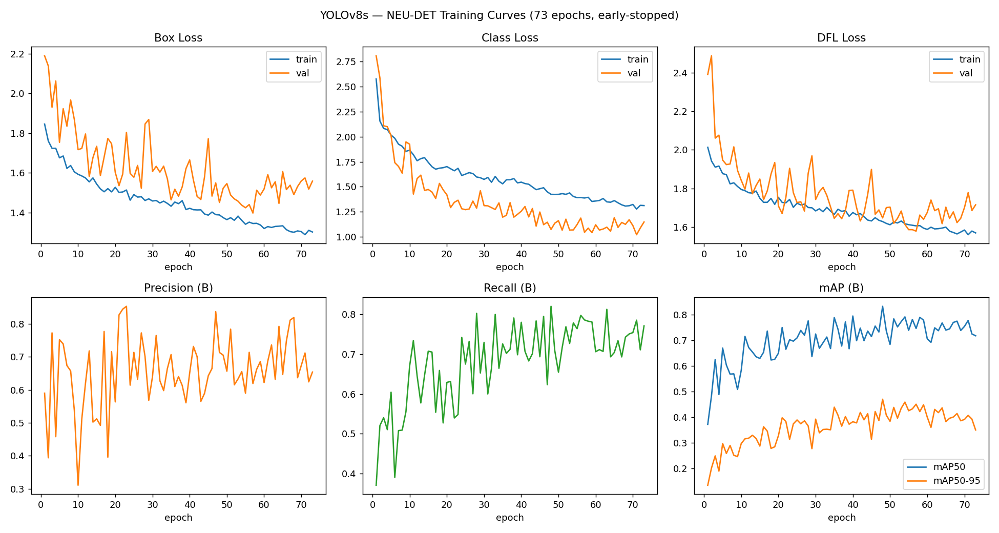

# Week 6 Results — YOLOv8 Surface Defect Detection

> **How these numbers were obtained:** `best.pt` in this folder is the real trained
> checkpoint. Its own metadata (Ultralytics saves full per-epoch training history
> inside the checkpoint file itself) was extracted directly using
> `extract_checkpoint_metadata.py` in this folder — no GPU or torch install needed for
> that step. `plot_training_curves.py` turned the recovered history into the chart
> below. These numbers are real, straight from your trained model — not estimated.
>
> They are the metrics Ultralytics logged on the **validation split during training**,
> not a fresh run against the **held-out test split**. Per-class breakdown, confusion
> matrix, and sample prediction images need an actual `evaluate.py` run against the
> dataset — see "Still Needed" below.

## Setup

- **Model used**: `yolov8s.pt` (small) — base checkpoint fine-tuned via transfer learning
- **Epochs**: 100 requested, **73 actually run** (early stopping, `patience=25`; best epoch was 48, so 48+25=73 checks out exactly)
- **Image size**: 640
- **Batch size**: 16
- **Optimizer**: AdamW, `lr0=0.001`, seed 42
- **Dataset**: NEU-DET (`NEU-DET/data.yaml`), 6 classes

## Metrics at the Best Checkpoint (val split, from training history)

| Metric | Value | Assignment Target | Tier reached |
|---|---|---|---|
| Precision | **0.713** | ≥0.80 (good) / ≥0.90 (excellent) | Below "Good" |
| Recall | **0.820** | ≥0.60 (good) / ≥0.75 (excellent) | Excellent |
| mAP@50 | **0.832** | ≥0.75 (good) / ≥0.85 (excellent) | Good (near Excellent) |
| mAP@50-95 | **0.470** | ≥0.40 (good) / ≥0.50 (excellent) | Good (near Excellent) |

**Honest read on this:** recall, mAP@50, and mAP@50-95 all land in "Good" or better —
a solid result for a fine-tuned `yolov8s` on ~1,800 images. Precision is the one metric
below target (0.713 vs. 0.80 needed), meaning the model produces more false positives
than the assignment's bar calls for. In a QA context, recall usually matters more than
precision (missing a real defect is worse than double-checking a clean part), so this
isn't disqualifying — but it's worth naming rather than glossing over, since it's
exactly the kind of number worth being able to explain. Levers to try if there's time:
raise the confidence threshold at inference (trades recall back for precision), more
augmentation, or revisiting whether any class has noisy/ambiguous ground-truth boxes
(cross-check against Week 5's EDA).

## Training Curves

Loss curves (top row) converge cleanly — validation loss is noisier than training loss
(expected on a dataset this size) but trending down, not diverging, so there's no sign
of overfitting driving the early stop. Precision/recall/mAP (bottom row) stay visibly
noisy epoch-to-epoch even late in training (small validation set), but mAP@50 clearly
trends upward across the run.

## Per-Class Breakdown

**Not yet available.** The checkpoint only stores the aggregate ("(B)" = all-boxes)
metrics above, not a per-class table — that requires an actual `model.val()` /
`evaluate.py` run, which needs the dataset.

| Class | Precision | Recall | AP@50 |
|---|---|---|---|
| crazing | — | — | — |
| inclusion | — | — | — |
| patches | — | — | — |
| pitted_surface | — | — | — |
| rolled-in_scale | — | — | — |
| scratches | — | — | — |

## Screenshots to Attach

- [x] Training curves — `results/results_reconstructed.png` (reconstructed from checkpoint history)
- [ ] Confusion matrix — needs a real `evaluate.py` run
- [ ] Sample predictions — needs a real `evaluate.py` / `model.predict()` run

## Model Size Comparison

Not run — only the `yolov8s` checkpoint exists in this repo. If there's time,
`compare_models.py` (if you have one, or adapt `train_yolo.py`) would run nano/small/
medium back to back for this table; otherwise note that `yolov8s` was chosen directly.

**Chosen model**: `yolov8s.pt` — balances enough capacity for a 6-class, moderately
complex texture-defect task against training/inference time on a free-tier Colab GPU.
Not empirically validated against nano/medium in this run.

## Still Needed (in order, on a machine with GPU + dataset access)

1. `python setup_dataset.py` — re-download NEU-DET (needs Kaggle auth)
2. `python evaluate.py --weights best.pt --data ./NEU-DET/data.yaml --split test` — this
   gets you: official test-split Precision/Recall/mAP@50/mAP@50-95 (may differ slightly
   from the val-split numbers above), the per-class table, the confusion matrix, and
   sample prediction images
3. Paste the real per-class table and confusion matrix screenshot into this file,
   replacing the placeholders above

## Notes / Issues Encountered

- Training stopped at epoch 73 rather than the requested 100 — early stopping
  triggered exactly 25 epochs (the configured `patience`) after the best epoch (48),
  which is intended behavior, not a bug.
- Precision is the one metric below the "Good" target band — see discussion above.
